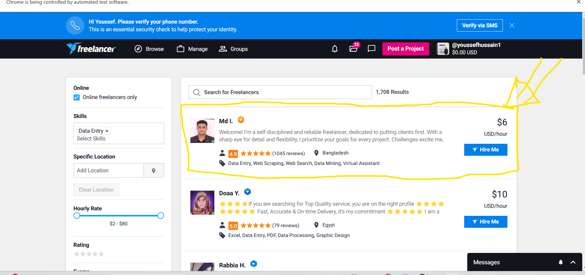

# Scrapping Project Documentation

---

##### Notebook: Scrapping the main box.ipynb Created by: Youssef
##### Purpose The goal of this notebook is to collect and scrape data about every freelancer, including all relevant information.
##### Timeline
- **deadline:** 02/03/2025
- **End Date:** 01/03/2025

---
##### Notebook: Scraping Freelancer description.ipynb Created by: Israa 
##### Purpose This notebook extracts data related to **freelancers**, including their **description**, **skills**, **rating**, and **reviews**.
##### Timeline
- **deadline:** 04/03/2025
- **End Date:** 03/03/2025

---
##### Notebook: Scraping Freelancer name.ipynb Created by: Youssef
##### Purpose This notebook extracts data related to **freelancers**, including their **name**, **salary**, **country**, and **level image**.
##### Timeline
- **deadline:** 05/03/2025
- **End Date:** 03/03/2025

---
##### Notebook: People per hour.ipynb Created by: Mohamed Mohie
##### Purpose This notebook extracts data related to **People per hour**, including their **name**, **Description**, **Nationality**,**Rating**,**Total Votes**, and **Price**.
##### Timeline
- **deadline:** 06/03/2025
- **End Date:** 05/03/2025
---
##### Notebook: kolabtree data scraping.ipynb Created by: youssef
##### Purpose This notebook extracts data related to **kolabtree**, including their **name**, **Description**, **Nationality**,**Rating**,**Total Votes**, and **Price**.
##### Timeline
- **deadline:** 06/03/2025
- **End Date:** 06/03/2025
---
##### Notebook:fiver.ipynb Created by: Israa
##### Purpose This notebook extracts data related to **fiver**, including their **name**, **Description**, **Nationality**,**Rating**,**Total Votes**, and **Price**.
##### Timeline
- **deadline:** 06/03/2025
- **End Date:** 07/03/2025
---

